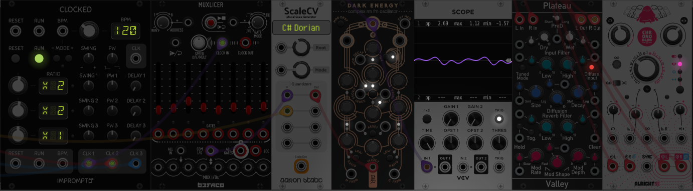

# VCV Rack Patch Implementation

Implementation of simple yet beautiful patch from VCV Rack.

To run locally: 

```bash
git clone https://github.com/merkwur/vcv-rack-patch-implementation.git
cd vcv-rack-patch-implementation
npm install
npm run dev
```

I have tried to implement this patch. 




## TO-DO  

For Synthesizer:
 - Cross Modulation for Synthesizer

For Qunatizer:
 - Chord Picker 
 - Mode Picker 
 - Octave Picker

For Mixer Effects:
 - Create Delay
 - Create Reverb

For Scope:
 - Create an Analyser component:
 - Visualize Them


